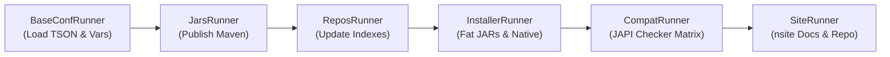

# 📚 Nuts Documentation & Public Website Hub

Welcome to the **Nuts Documentation Hub**. This directory contains the complete source materials for the **Nuts** ecosystem's public documentation, technical specifications, framework tutorials, slide presentations, brand assets, syntax highlighting packages, and static website generators.

---

## 🌐 Public Resources & Links

* **Official Website**: [https://thevpc.github.io/nuts](https://thevpc.github.io/nuts)
* **Nuts Core Documentation**: [https://thevpc.github.io/nuts/doc-nuts.html](https://thevpc.github.io/nuts/doc-nuts.html)
* **NAF (Nuts Application Framework) Documentation**: [https://thevpc.github.io/nuts/doc-naf.html](https://thevpc.github.io/nuts/doc-naf.html)
* **Application Catalog**: [https://thevpc.github.io/nuts/apps.html](https://thevpc.github.io/nuts/apps.html)
* **Downloads & Releases**: [https://thevpc.github.io/nuts/download.html](https://thevpc.github.io/nuts/download.html)
* **FAQ**: [https://thevpc.github.io/nuts/faq.html](https://thevpc.github.io/nuts/faq.html)
* **Blog & Release Notes**: [https://thevpc.github.io/nuts/blog.html](https://thevpc.github.io/nuts/blog.html)

---

## 📁 Directory Structure Overview

```text
documentation/
├── integration/         # Syntax highlighting packages & install rules for popular editors & IDEs
│   ├── ntf-support/     # Nuts Text Format (NTF) syntax support (VSCode, IntelliJ, Vim, etc.)
│   └── tson-support/    # Type Safe Object Notation (TSON) syntax support
├── media/               # Brand identity assets: vector logos, icons, fonts, and design history
├── presentations/       # Technical slide decks (AsciiDoc, PDF, NTexUp terminal presentations)
├── repo/                # Repository root template files and dev scripts processed during release
├── specifications/      # Formal language and format specifications (NTF, TSON, TSON-Schema)
├── term-cast/           # Terminal session recording scripts (VHS) and animated demos (WebP)
├── tutorials/           # Comprehensive NAF developer tutorials and practical CLI showcases
└── website/             # Source code, templates, scripts, and assets for the static documentation website
```

---

## 📂 Subdirectories in Detail

### 1. `integration/` — Editor & IDE Syntax Highlighting
Contains grammar definitions, syntax highlighters, and auto-install configuration files (`sys-editor-support.tson`) for:
* **NTF (Nuts Text Format)**: Rich console formatting, semantic tags, and ANSI styling.
* **TSON (Type Safe Object Notation)**: Strongly-typed structured configuration and DSL format.

#### Supported Editors & IDEs:
* **VS Code** (`vscode/`): Language configurations and TextMate grammar (`language.tmLanguage.json`).
* **IntelliJ IDEA** (`intellij/`): XML custom language definitions.
* **Vim** (`vim/`): Syntax and file type detection scripts (`language.syntax.vim`, `language.ftdetect.vim`).
* **Kate** (`kate/`): KSyntaxHighlighting XML definitions.
* **Gedit** (`gedit/`): GtkSourceView `.lang` definitions.
* **JEdit** (`jedit/`): Mode catalog definitions.
* **Notepad++** (`notepad-plus-plus/`): User-defined language XML files.

#### Installation Commands:
Syntax highlighting can be installed automatically via Nuts CLI:
```bash
# Install NTF syntax highlighting for an editor
nuts settings install-ntf-editor-syntax <vscode|intellij|vim|kate|gedit|jedit|notepad-plus-plus>

# Install TSON syntax highlighting for an editor
nuts settings install-tson-editor-syntax <vscode|intellij|vim|kate|gedit|jedit|notepad-plus-plus>
```

---

### 2. `media/` — Brand Identity & Graphic Assets
Contains official brand artwork and vector graphics:
* **Logos**: `nuts-logo.svg`, `nuts-logo.png`, high-res `nuts-logo-1280.png`, compact `nuts-logo-200.png`.
* **Icons**: `nuts-icon.svg`, `nuts-icon.png`, Windows icon `nuts-icon.ico`, macOS icon `nuts-icon.icns`.
* **Typography**: `fonts/ZeroesTwo.ttf` — the official font used in the Nuts identity.
* **Archive**: `old/` contains previous iterations, 2025/2026 drafts, and asset zip archives.

---

### 3. `presentations/` — Slide Decks & Presentations
Contains architectural and conceptual slide decks in multiple formats:
* **`001-Rationale/`** (`nuts-presentation-001-rationale.adoc` / `.pdf`):
  * Explains the core motivations behind Nuts: runtime dependency management, classpath generation, eliminating the need for fat JARs, and automatic transparent JDK provisioning.
* **`002-Components/`** (`nuts-presentation-002-components.adoc` / `.pdf`):
  * Architectural breakdown: Nuts core, workspaces, repositories, package lifecycle, and runtime sandboxing. Includes GraphML architecture diagrams.
* **`003-API/`** (`nuts-presentation-003-API.adoc` / `.pdf`):
  * Nuts Application Framework (NAF) API, workspace/session context model, execution flowcharts, and command-line lifecycle.
* **`004-presentation/`** (`main.ntx`, `pages/`):
  * Interactive terminal-based presentation powered by `ntexup` (`nuts-dev ntexup show`).
* **`shared/asciidoctor/`**: Shared theme definitions (`resources/themes`) and font packages (`resources/fonts`).
* **`deprecated/`**: Legacy OpenDocument presentation (`2021-06-25-nuts.odp`).

#### Building Presentations:
Presentations can be compiled to PDF using Asciidoctor PDF:
```bash
# Build all PDF presentations
cd documentation/presentations && ./make-all

# Or build individual presentation decks
cd documentation/presentations/001-Rationale && ./make-this
```
> *Prerequisites*: `asciidoctor-pdf`, `asciidoctor-diagram`, and a running PlantUML server (e.g. `docker run -d --name plantuml -p 8081:8080 plantuml/plantuml-server:jetty`).

---

### 4. `repo/` — Repository Templates & Dynamic Sync
Contains dynamic templates used by `nuts-release-tool` to maintain consistent versioning across repository files:
* **`src/main/README.md`**: Template for the root `$NUTS_REPO_ROOT/README.md` using NExpr dynamic version tokens (e.g., `{{runtimeVersion}}`, `{{stableRuntimeVersion}}`).
* **`src/main/CONTRIBUTING.md`**: Template for root contribution guidelines.
* **`src/main/scripts/`**: Development shell helpers (`nuts-dev`, `nsh-dev`, `nuts-example-debug`).

When `nuts-release-tool` runs, these templates are evaluated and written to the repository root.

---

### 5. `specifications/` — Formal Specifications
Contains formal specifications for Nuts data formats and markup languages:
* **[`ntf.md`](specifications/ntf.md)** — **Nuts Text Format (NTF v1.0)**:
  * Markdown-like format for rich, portable terminal formatting and console logging.
  * Hierarchical titles (`#) Title`), inline styles (`##:bold: text##`, `##:underlined: text##`), 4-bit/8-bit/24-bit RGB colors, semantic tags (`success`, `warn`, `error`, `keyword`, `option`), verbatim blocks, code syntax blocks, and `!include` directives.
* **[`tson.md`](specifications/tson.md)** — **Typed Structured Object Notation (TSON v2.0)**:
  * Strongly-typed, human-centric configuration and DSL format.
  * Native literal intelligence (dates, timestamps, arbitrary-precision numbers, unit suffixes `u16`, `ms`, `%`), literal-first string semantics (death of backslash escaping), multi-mode quotes, documentary paragraphs (`¶`), and exhaustive symbol catalog.
* **[`tson-schema.md`](specifications/tson-schema.md)** — **TSON Schema**:
  * Structural definition and validation rules for TSON documents.

---

### 6. `term-cast/` — Terminal Casts & Demos
Contains terminal recording scripts and high-definition animated demonstrations:
* **`nuts-install-demo.tape`**: Terminal recording script for [VHS](https://github.com/charmbracelet/vhs).
* **`nuts-install-demo.webp`**: The generated animated demo displayed on the project README and landing page.
* **`build-nuts-install-demo`**: Shell script automating clean environment setup, running `vhs`, and converting output to animated WebP via `ffmpeg`.

#### Re-recording the Terminal Demo:
```bash
cd documentation/term-cast && ./build-nuts-install-demo
```
> *Prerequisites*: `vhs` and `ffmpeg`.

---

### 7. `tutorials/` — Developer Tutorials & Showcases
Contains comprehensive guides for users and developers:
* **[`FWK-TUTORIAL.md`](tutorials/FWK-TUTORIAL.md)** — **Building NutsAdminCLI (10-Module NAF Tutorial)**:
  * **Module 1**: Standalone Bootstrapping & Lifecycle (`NWorkspace`, `NSession`, `@App`, `@NAppRun`, `@NAppInstall`).
  * **Module 2**: Command-Line Parsing (`NCmdLine`, `NArg`, non-destructive peeking/consuming, auto-complete).
  * **Module 3**: Structured Messaging & Terminal Styling (`NMsg`, `NOut`, `NErr`, `NLog`, `NLogIntent`, NTF markup).
  * **Module 4**: Filesystem Abstraction & Integrity (`NPath`, `NCp`, `NDigest`, XDG directories, HTTP/remote streams).
  * **Module 5**: Structured Data Processing (`NElement`, `NElementReader`, `NElementWriter`, JSON/XML/TSON).
  * **Module 6**: Concurrency & Asynchronous Tasks (`NThreadPool`, `NPromise`, progress monitors).
  * **Module 7**: Cross-Platform Process Execution (`NExec`, `NProcessExec`, stream redirection).
  * **Module 8**: Dynamic Expression Evaluation (`NExpr`, custom functions, variable scopes).
  * **Module 9**: Dynamic Loading & Plugin Architecture (`NExtensions`, service discovery).
  * **Module 10**: Spring Boot Bridge & Logging (`nuts-spring`, bridging native NAF logging to SLF4J).
* **[`SHOWCASE.md`](tutorials/SHOWCASE.md)** — **Nuts CLI Showcase**:
  * Practical, zero-configuration copy-paste commands to run IDEs (NetBeans, JEdit), Web & Application Servers (Tomcat, Jetty running WAR files), portable local database instances without `sudo` (PostgreSQL, Derby, H2, HSQLDB), and utilities.

---

### 8. `website/` — Documentation Website Sources
Source templates, entry-point HTML pages, modular markdown inclusions, and static assets evaluated by **`nsite`** (via `nuts-release-tool`) to compile the static website in `$NUTS_REPO_ROOT/docs/` (hosted on GitHub Pages at [https://thevpc.github.io/nuts](https://thevpc.github.io/nuts)).

> 📖 **Full Guide**: For detailed documentation on page templates, modular inclusions (`src/include/`), static resources (`src/resources/`), and deprecated archive folders, see **[website/README.md](website/README.md)**.

---

## 🛠️ Build & Release Engine (`nuts-release-tool`)

The documentation website, repository root metadata, fat JARs, native executables, repository indexes, and API compatibility reports are orchestrated by `nuts-release-tool` (`net.thevpc.nuts.build`).

### ⚙️ Build Pipeline & Runner Architecture

When `nuts-release-tool` runs, it executes a sequential chain of specialized runners:



### ⚙️ Build Pipeline & Runner Architecture

When `nuts-release-tool` runs, it orchestrates fat JAR packaging, native binaries, API compatibility reports, and static website compilation via `nsite`.

> 📖 **Full Configuration Reference**: For detailed runner architecture, configuration flags (`build-jars`, `build-native`, `build-site`, `publish`, `vars`), and `nuts-release-tool.tson` options, see **[website/README.md](website/README.md)**.

### 🚀 Running the Build

From the repository root:
```bash
# On Linux / macOS:
./nuts-release-tool

# On Windows:
nuts-release-tool.bat
```

---

## 📊 Summary Quick Reference

| Directory | Content Type | Key Formats / Technologies | Build / Generator Tool | Primary Output |
| :--- | :--- | :--- | :--- | :--- |
| **`integration/`** | Syntax Highlighters | JSON, XML, VimScript, Lang | `nuts settings install-*-editor-syntax` | Editor configuration files |
| **`media/`** | Brand Identity | SVG, PNG, ICO, ICNS, TTF | N/A (Source assets) | Web and desktop icons/logos |
| **`presentations/`**| Technical Presentations | AsciiDoc, PDF, NTexUp | `asciidoctor-pdf`, `ntexup` | PDF files & interactive TUI slides |
| **`repo/`** | Root Templates | Markdown, Bash, NExpr | `nuts-release-tool` | `$NUTS_REPO_ROOT/README.md`, etc. |
| **`specifications/`**| Specifications | Markdown | N/A (Standard specs) | Reference documents (NTF, TSON) |
| **`term-cast/`** | Motion Demos | VHS Tape, WebP, GIF | `vhs`, `ffmpeg` | `nuts-install-demo.webp` |
| **`tutorials/`** | Guides & Showcases | Markdown | N/A (Developer docs) | `FWK-TUTORIAL.md`, `SHOWCASE.md` |
| **`website/`** | Public Documentation | HTML, SCSS, JS, NExpr | `net.thevpc.nuts:nsite` | `$NUTS_REPO_ROOT/docs/` (GitHub Pages) |


