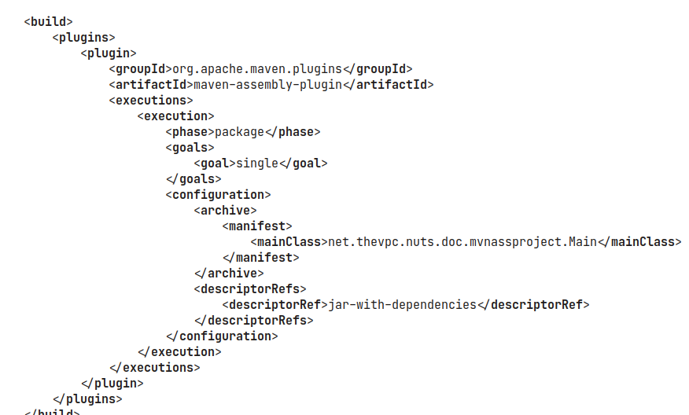
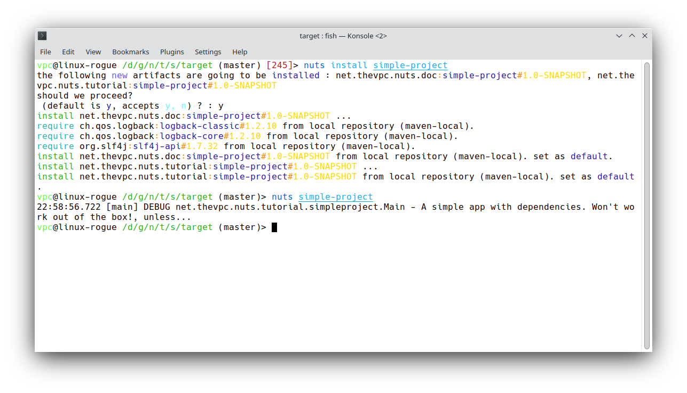
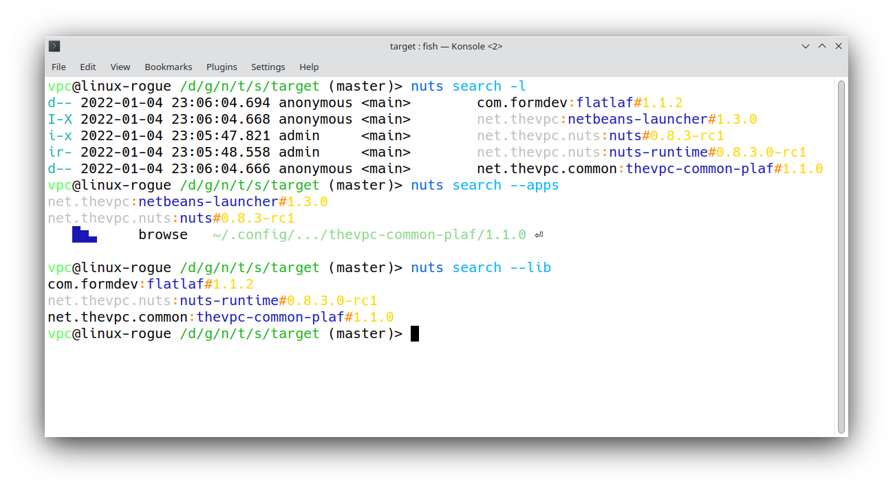
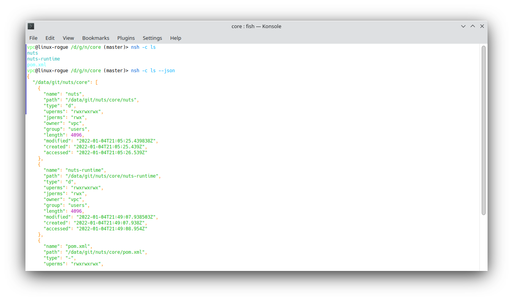
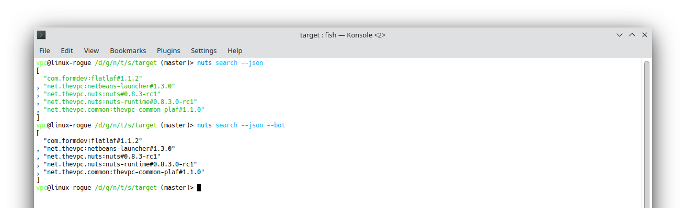

= nuts, the Java Package Manager
:pdf-page-size: 9in x 6in
:source-highlighter: pygments
:icons: font
:icon-set: pf
:revnumber: v0.8.5.0
:revdate: 2025-01-04
//:revremark: Private use only - (Taha BEN SALAH)
:appendix-caption: Appx
:sectnums:
:sectnumlevels: 8
:stem: latexmath
//:title-logo-
//:front-cover:images/nuts-logo.png[]

//{zwsp} +
//{zwsp} +
//{zwsp} +
//{zwsp} +


[.text-center]
https://github.com/thevpc/nuts (git repo)

[.text-center]
https://thevpc.github.io/nuts  (website)

[.text-center]
nuts.packagemanager@gmail.com

[.text-center]
thevpc, 2025-01-04

:toc:
:toclevels: 4

<<<

**Plan**

1. Why a package manager
2. `nuts` features
3. Demo


<<<

== Why a Package Manager

* Popularity of a language is proportional to popularity of its PM
** `Javascript`: `npm`/`npx`/`yarn`
** `Python`: `pip`, `conda`
** `Ruby`: `rubygems`

* Newcomer languages already include a PM
** `golang` package manager (modules)

* `Java` ecosystem already have more than 7M packages deployed

<<<

=== Java Package Manager?

* `maven`, `gradle`
** Build tools
** Dependency-management tools
** Poor package/deployment management (`maven` 's `deploy` is a build time stage)
** Lack of deployment lifecycle (install/uninstall/update)

<<<

=== Example
Let's take a `hello-world` example with dependencies :

```java
package net.thevpc.nuts.doc.baseproject;

import org.slf4j.Logger;
import org.slf4j.LoggerFactory;

public class Main {
private static final Logger LOG = LoggerFactory.getLogger(Main.class);
    public static void main(String[] args) {
        LOG.debug("A simple app with dependencies. Won't work out of the box!, unless...");
    }
}

```
<<<

=== pom.xml
A minimal `pom.xml`  is:

```xml
<?xml version="1.0" encoding="UTF-8"?><project xmlns="..."><modelVersion>4.0.0</modelVersion>
<groupId>net.thevpc.nuts.doc</groupId>
<artifactId>base-project</artifactId>
<version>1.0-SNAPSHOT</version>
<dependencies>
<dependency>
    <groupId>ch.qos.logback</groupId>
    <artifactId>logback-classic</artifactId>
    <version>1.2.10</version>
</dependency>
</dependencies>
</project>
```

<<<

=== Example
* With a minimal `pom.xml` we cannot execute unless we add the transitive  `dependencies` to the classpath
* We also need to adjust the pom.xml to include the main class too!

image::images/java-error2.png[scaledwidth=100%]

<<<


=== Alternatives for deployment

* Java Web Start
* System PM / Installers
* jpackage, jlink
* Portable Installers
* Custom Deployments
* Build time Processors (Fat Jars)

<<<

=== Java Web start

* Run Remote App using `jnlp` file (with all of it dependencies)
* Special packaging
* Execution Sandbox : More Limitations
* Deprecated!! since Java9
* No Shared Dependencies / Centralized Dep Mgt
* The same applies to alternatives : `trivrost`, `OpenJNLP`

<<<

=== System PM / Installers

* `rpm`, `deb`, `dmg`, `msi`
** Native integration with OS/Env
** Centralized management
** Automatable (cmdline)
** Not portable
** Multiple deployment packages for each release
** Problem with installing multiple versions of the same package

<<<

=== JPackage jlink

* `rpm`, `deb`, `dmg`, `msi`
** All System PM / Installers applies
** Not portable
** java 8- not supported
** requires all dependencies to be packaged as rpm/deb or be bundled for each app
** JRE bundled each time!

<<<

=== Portable Installers
* `InstallAnywhere`, `GetDown`, `IzPack`, BitRock `InstallBuilder`
** Good integration with OS/Env
** No centralized management
** Disk and network overload of dependencies
** Graphical! not suitable for automation (most of the time)
** Still Manual

<<<

=== Custom Deployers

* Custom (tomcat, netbeans) with multiple formats (tarball, zip)
** Manual
** No centralized management
** Difficult to automate
** Lack of integration with environment
** Disk and network overload of dependencies


<<<

=== Fat Packages: maven-dependency-plugin

* `maven-dependency-plugin`
** Maven plugin
** Jars included in the "lib" folder
** Still need to bundle the jar and the lib folder (zip with `maven-antrun-plugin`)

image::images/maven-dependencies-xml.png[]
image::images/maven-dependencies-jar.png[]


<<<


=== Fat Jars : Uber Jar
* `maven-assembly-plugin`
** Jars deflated into the same jar
** Can rewrite classes/resources
* `maven-shade-plugin`
** Jars deflated into the same jar
** Rewrites classes/resources
** Simpler than `maven-assembly-plugin`


image::images/assembly-jar.png[scaledwidth=80%]


<<<

=== Fat Jars : Jar Jar
* `onejar-maven-plugin`
** Rewrites jar to include dependencies as jars!
** Adds bootstrap classes
** Changes classloader
* `spring-boot-maven-plugin`
** Rewrites jar to include dependencies as jars!
** Adds bootstrap classes
** Changes classloader

image::images/spring-boot-xml.png[scaledwidth=80%]
image::images/spring-boot-jar.png[scaledwidth=80%]

<<<

=== So...

* All alternatives are *poor* and/or *ugly*
* `pom.xml` polluted with +16-20 lines of code
* [line-through]#Why do we need a package manager for `Java`#
* Why don't we already have a package manager for `Java`!

<<<

== nuts Package Manager for Java

Main Idea:

* Little to no Intrusion and Backward compatibility to support existing apps and repos
* Good Integration with Java ecosystem and popular build/deploy/devops tools
* Solid enough to support multiple platforms
* Simple but extensible
* Open Source

<<<

=== nuts: A Package Manager for Java

* Centralized package manager for Java Apps and Libs (not only)
**  `install`,  `uninstall`,  `update`, `search` and `exec` for packages
** Optimized dependency resolution solver
** Cache for dependencies across installed apps
* Automation/devops friendly commandline tool
* Portable across Architectures, OSes,  OS Distibs, Desktop Environments, Platforms (Java versions)
* Libre and Open Source, developed in java

<<<

=== nuts: A Package Manager for Java

Is Not:

* a replacement for `maven`, `gradle` or any build tool (used at deploy time)
* a plugin for `maven`, `gradle` or any build tool (do not change the build process)
* a replacement for `spring` framework or any other framework
* a replacement for `IzPack` or `InstallAnywhere` (but can do pretty much of it)
* a replacement for `ansible` or `chef` (but is conceptually driven by automation)
* a mere download tool

<<<

=== nuts: Maven & Gradle

* Integrates seamlessly with `maven`
** No required modification of the build process
** Does not alter/rewrite the package
** No special `maven`/`gradle` plugin needed
* Supports local Jars, public packages (maven central), and private packages (local .m2, nexus repos,...)
* Solves at runtime what `maven`/`gradle` solve at build time
** Supports `maven` and `gradle` dependency resolution algorithms, scopes, ...

<<<

=== nuts: Dependency Optimization

* Downloads, Caches and Installs only relevant dependencies according to
** `arch` (hardware architecture: x86, x64, relevant for native dependencies)
** `os` (operating system: Win/Linux/Mac, relevant for specific tasks)
** `osDist` (operating distribution : Ubuntu/OpenSuse,...)
** `desktop` (desktop environment, relevant for icon/shortcut creation and environment integration)
** `platform` (java SE versions installed to know what dependencies to use)

<<<

=== nuts: Integration

* Solid integration with environments
** Uses OS's File System Layouts (XDG for Linux, ...)
*** separate folders per app
*** separate folders for log, config, lib, cache, etc.
*** portable across OSes (~/.config versus ~/AppData)
** Supports cmdline and gui apps (installs scripts, icons, menus, ...)
** Supports `jar` and `zip` based apps

<<<

=== nuts: Toolbox

** Terminal Coloring on Linux/Windows
** Supports Windows `cmd`/`PowerShell` and *NIX `sh`, `bash`, `csh`, `zsh` and `fish` and their relative `rcfiles`
** Bundles a `bash`/`GNU binutils` compatible (still incomplete) but **enhanced** java implementations
*** ls, cp, touch, mkdir, rmdir, ...
*** works on windows
*** adds some extra goodies (ssh, json, support ...)

<<<

=== nuts: Existing Apps

* Supports out of the box
** `maven` 's repos (including central, spring, google, ...), more than 7M dependencies
** Apache repos (`netbeans`, `tomcat`, `derby`, etc...)

<<<

=== nuts: Automation
* Powerful toolbox with customizable output formats
** `props`
** `xml`
** `json`
** `yaml`
** `table`
** `tree`

<<<

=== nuts: Unique features
* Is statically built and has (almost) no dependencies
* Can be used as a library to support transitive ClassPath resolution
* Has a clean and rich API

<<<

=== nuts: Stability

* Tested:
** over 160 regression tests with 3500+ lines of test-code in the repository.
** `opensuse`, `ubuntu`, `docker`, `windows7`, `windows10`
** `sh`, `bash`, `csh`, `zsh`, `fish`

<<<

=== 'nuts'... really?

* `N` etwork   `U` pdatable   `T` hings `S`   ervices
* The `nuts` (fool) companion for the `maven` (sage) in the Software Kingdom's Palace!


<<<

== Demonstration

=== Install Nuts

1. Download `nuts.jar`
2. Run `java -jar nuts.jar -Zy`
3. Restart your terminal

<<<

=== Install Nuts (Linux)

* Install for Preview/Evaluation, most `recent`

```sh
$ wget https://maven.thevpc.net/net/thevpc/nuts/nuts-app/0.8.6/nuts-app-0.8.6.jar -o nuts.jar
$ java -jar nuts.jar -Zy -r=+preview
$ exit
```

* Install for Production, most `stable`

```sh
$ wget https://maven.thevpc.net/net/thevpc/nuts/nuts-app/0.8.5/nuts-app-0.8.5.jar -O nuts.jar
$ java -jar nuts.jar -Zy
$ exit
```

* In all cases, do not forget to `restart` your terminal

<<<

=== Run the app

* We just run the app
* No modification is required
* We use the already built (by maven) jar
* The "artifactId" is (almost) sufficient to resolve the application to install

image::images/nuts-simple-run.png[]

<<<

=== Demonstration : Install Application

* Or we can install the app
** All `required` dependencies will be resolved and downloaded
** dependencies are shared across multiple apps
** multiple versions of the same dependencies can coexists (required by different apps)
* And then we run it



<<<

=== Install Gui App

* We can run a gui app of course
* `nuts` will create for it
** a Desktop Shortcut (Icon)
** a Menu Item

image::images/nuts-install-nbl.png[scaledwidth=100%]

<<<

=== Search for available applications
* We can search for installed or available (local/remote) apps
* We can search for apps and/or libs



<<<

=== Repositories
* We can configure Repositories used to install/update packages
* We can list Repositories used to install/update packages
* Supports
** Standard Maven Repositories
** Plain Folders
** Browsable HTTP folders (Parses HTML for common Webserver Directory Lists)

image::images/nuts-list-repos.png[scaledwidth=100%]

<<<

=== Integration and Formats
* Customize any command's output to use structured/parsable or user friendly output formats
* All Commands support options!
** structured (parsable) : `--json`,  `--xml`, `--props`, `--yaml`
** unstructured : `--plain`, `--table`  , `--tree`

image::images/nuts-simple-format.png[scaledwidth=100%]

<<<

=== Companions
* We can use `nsh` instead of `bash` / `cmd`
* Implements common internal bash commands (`cd`,...) and constructs (`pipes`,...)
* Implements common `binutils` commands (`ls`,`mkdir`,....)
* All commands support `json` (and `yaml`, ...) out of the box
* All commands support `ssh` and extended path format (including URLS) out of the box, so that `cp` can be used as a simple alternative to `wget`



<<<

=== Bot Mode
* Running with `--bot` will disable all interaction and terminal coloring



<<<

=== Help
* An extensive help is available from within the command line

image::images/nuts-help.png[scaledwidth=80%]

<<<

=== Conclusion

* `nuts` tries to be for `java` what `npm` is for javascript
* `nuts` is a versatile toolbox
* `nuts` is `2800+` classes, `600ko+` boot jar
* I invite you to
** Take a shot, try to use it and give feedback
** `Star(*)` the repository https://github.com/thevpc/nuts
** Spread the word
** Join the Core Team to enhance `nuts`

<<<

[.text-center]
Thank you

[.text-center]
please support us by starring our repo at
[.text-center]
https://github.com/thevpc/nuts (git repo)

[.text-center]
https://thevpc.github.io/nuts  (website)

[.text-center]
nuts.packagemanager@gmail.com
