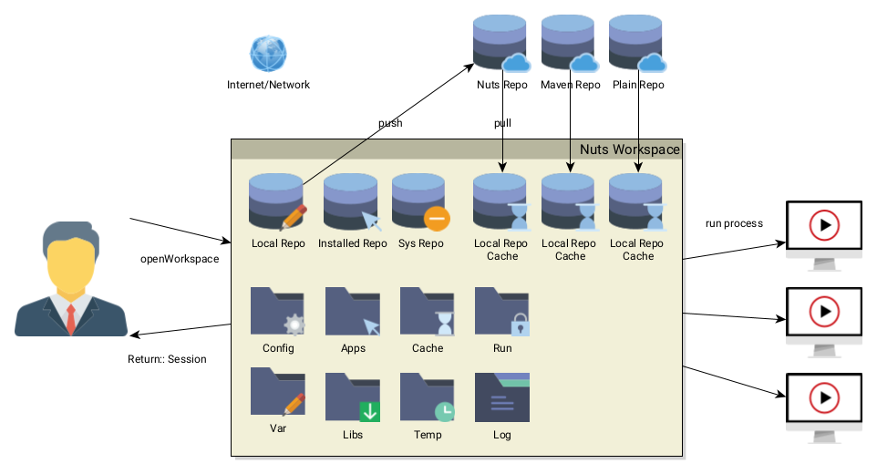
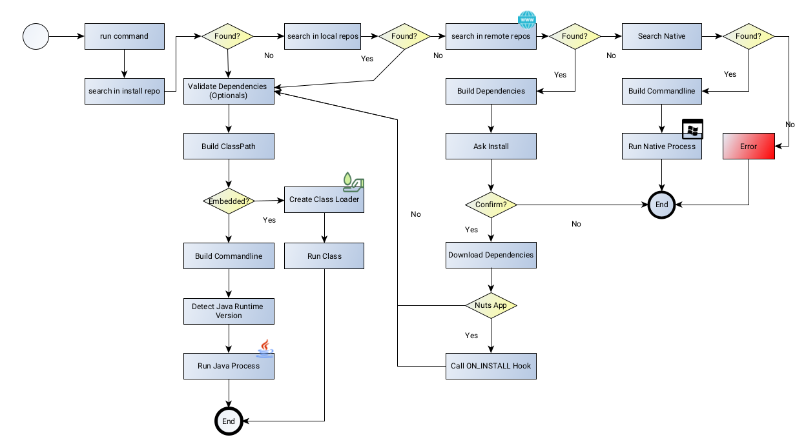

= nuts, the Java Package Manager
:pdf-page-size: 9in x 6in
:source-highlighter: pygments
:icons: font
:icon-set: pf
:revnumber: v0.8.5.0
:revdate: 2025-01-04
//:revremark: Private use only - (Taha BEN SALAH)
:appendix-caption: Appx
:sectnums:
:sectnumlevels: 8
:stem: latexmath
//:title-logo-image:images/nuts-logo.png[]
//:front-cover:images/nuts-logo.png[]

//{zwsp} +
//{zwsp} +
//{zwsp} +
//{zwsp} +

image::images/nuts-logo.png[scaledwidth=40%,align="center"]

[.text-center]
https://github.com/thevpc/nuts (git repo)

[.text-center]
https://thevpc.github.io/nuts  (website)

[.text-center]
nuts.packagemanager@gmail.com

[.text-center]
thevpc, 2025-01-04

:toc:
:toclevels: 4

<<<

**Plan**

1. Architecture
2. API
3. Demo


<<<

== Architecture



<<<
== Nuts Commandline
* SYNOPSYS
```sh
nuts [options]
```
* Options can be long or short
```sh
nuts -S
nuts --standalone
```
* Options order is (generally) irrelevant
* Most relevant option :)
```sh
nuts --help
```

<<<

== Nuts Commandline Values
* Options can be valued
```sh
nuts -w=my-name
nuts -w my-name
nuts --workspace my-name
nuts --workspace=my-name

nuts -S
nuts -S=true

nuts -!S
nuts -~S
nuts -S=false
nuts -S=no
```

<<<
== Selecting workspace

* User Workspace defaults to ~/.config/nuts/default-workspace
```sh
nuts
```
* System workspace defaults to /etc/opt/nuts/default-workspace
```sh
nuts -g
```
* You can customize it
```sh
nuts --workspace <workspace-location>
```

<<<

== Creating Workspaces

* Workspace created on the first use
* Open existing workspace or fail if not already existing
```sh
nuts --open
```

<<<

== Creating Workspaces

* Defining the default repositories with  'archetypes'
```sh
nuts --archetype=default
nuts --archetype=server
nuts --archetype=minimal
```

<<<

== Folders

* Each (installed) App has distinct folders
** app : app (executable) binaries
** lib : lib (non executable) binaries
** config : config files
** var : variable data files
** log : log files
** temp : temp files
** cache : cache files
** run : run files (locks)

<<<

== Folders

* Mainly folder are following two layout families
** Linux,Unix,MacOS (XDG)
** Windows (AppData)

<<<

== Folders in Linux (user)

* config   : ```"$HOME/.config/nuts"```
* apps     : ```"$HOME/.local/share/nuts/apps"```
* lib      : ```"$HOME/.local/share/nuts/lib"```
* var      : ```"$HOME/.local/share/nuts/var"```
* log      : ```"$HOME/.local/log/nuts"```
* cache    : ```"$HOME/.cache/nuts"```
* temp     : ```"$java.io.tmpdir/$username/nuts"```
* run      : ```"/run/user/$USER_ID/nuts"```

<<<

== Folders in Linux (global/system)

* apps     : ```"/opt/nuts/apps"```
* lib      : ```"/opt/nuts/lib"```
* config   : ```"/etc/opt/nuts"```
* var      : ```"/var/opt/nuts"```
* log      : ```"/var/log/nuts"```
* temp     : ```"/tmp/nuts/global"```
* cache    : ```"/var/cache/nuts"```
* run      : ```"/tmp/run/nuts/global"```

<<<

== Folders in Windows

* apps     : ```"$HOME/AppData/Roaming/nuts/apps"```
* lib      : ```"$HOME/AppData/Roaming/nuts/lib"```
* config   : ```"$HOME/AppData/Roaming/nuts/config"```
* var      : ```"$HOME/AppData/Roaming/nuts/var"```
* log      : ```"$HOME/AppData/Roaming/nuts/log"```
* temp     : ```"$HOME/AppData/Local/nuts/temp"```
* cache    : ```"$HOME/AppData/Local/nuts/cache"```
* run      : ```"$HOME/AppData/Local/nuts/run"```

<<<

== Customize Folder Layout
* Mimic another OS

```sh
nuts --store-layout=system
nuts --store-layout=windows
nuts --store-layout=linux
```

* Exploded vs standalone

```sh
nuts --standalone
nuts --exploded
```

<<<


== Destroying a workspace

* Need to erase config (--reset, -Z) and skip boot (--skip-boot, -Q)
```sh
nuts -ZQ
```

<<<

== Working with Cache

* Invalidate only used files (New only)
```sh
nuts -N
```

* Invalidate All cache
```sh
nuts -z
```

<<<

== Running an Application

* Supported executables
** artifact (ex: ```org.jedit:jedit#5.0```,```jedit```)
** local jar (ex: ```./jedit.jar```)
** accessible jar (ex: ```http://jedit.org/jedit.jar```)
** accessible jar (ex: ```ssh://vpc@my-server/jedit.jar```)
** native applications (ex: ```ls```, ```cp``` etc on Linux and ```cmd.exe``` on Windows)
** any alias command to another supported executable (ex: ```nll=nsh -c ls -l```)

<<<

== Running an Application

```sh
nuts my-application
nuts --exec my-application
nuts --exec --java-version=9 -Xmx2G my-application
nuts --embedded --java-version=9 -Xmx2G my-application
nuts ls
nuts --system ls
```

<<<

== Running an Application



<<<

== Imports
```sh
nuts com.whitecape:white-app
nuts com.whitecape.yellow-app:yellow-app
nuts settings add import com.whitecape
nuts white-app
nuts yellow-app
nuts yellow-app#2.3
```

<<<

=== Conclusion

* `nuts` commandline is very rich
* `nuts` behaves seamlessly on linux/windows/macos
* I invite you to
** Take a shot, try to use it and give feedback
** `Star(*)` the repository https://github.com/thevpc/nuts
** Spread the word
** Join the Core Team to enhance `nuts`

<<<

[.text-center]
Thank you

[.text-center]
please support us by starring our repo at
[.text-center]
https://github.com/thevpc/nuts (git repo)

[.text-center]
https://thevpc.github.io/nuts  (website)

[.text-center]
nuts.packagemanager@gmail.com
