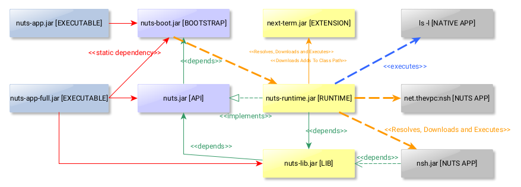

= nuts, the Java Package Manager
:pdf-page-size: 9in x 6in
:source-highlighter: pygments
:icons: font
:icon-set: pf
:revnumber: v0.8.5.0
:revdate: 2025-01-04
//:revremark: Private use only - (Taha BEN SALAH)
:appendix-caption: Appx
:sectnums:
:sectnumlevels: 8
:stem: latexmath
//:title-logo-image:images/nuts-logo.png[]
//:front-cover:images/nuts-logo.png[]

//{zwsp} +
//{zwsp} +
//{zwsp} +
//{zwsp} +

image::images/nuts-logo.png[scaledwidth=40%,align="center"]

[.text-center]
https://github.com/thevpc/nuts (git repo)

[.text-center]
https://thevpc.github.io/nuts  (website)

[.text-center]
nuts.packagemanager@gmail.com

[.text-center]
thevpc, 2025-01-04

:toc:
:toclevels: 4

<<<

**Plan**

1. API
2. Nuts as Library
3. Nuts as a Framework
4. Spring Integration


<<<

== Main Components



== Nuts as A Library
* Simply add nuts to your dependencies
* Compatible with java 1.8+

```xml
<dependency>
    <groupId>net.thevpc.nuts</groupId>
    <artifactId>nuts-lib</artifactId>
    <version>0.8.6</version>
</dependency>
```

<<<
== Nuts as A Library

* You can also add runtime to enforce the runtime version

```xml
<dependency>
    <groupId>net.thevpc.nuts</groupId>
    <artifactId>nuts-runtime</artifactId>
    <version>0.8.6.0</version>
</dependency>
```

<<<

=== Session API

```java
    // share allows NSession/NWorkspace to be accessible globally as a singleton
    Nuts.openWorkspace("-Z","-S","y","--json").share();
    // then you can get the current session anywhere in your code
    NSession session=NSession.of();
    session.setConfirm(NConfirmationMode.ASK);
    session.setOutputFormat(NContentType.XML);

    NOut.println("Hello");
    NOut.printlnf("Hello");

    NOut.println(Arrays.asList("Hello"));
    NOut.printlnf("Hello %s","world");
    NOut.println(NMsg.ofC("Hello %s","world"));
    NOut.println(NMsg.ofJ("Hello {0}","world"));
    NOut.println(NMsg.ofV("Hello $v",NMaps.of("v","world"));
```


<<<

=== Messages and text formatting
    Nuts Library allows multiple variants of string interpolation
```java
    NSession session=NSession.of();
    session.setConfirm(NConfirmationMode.ASK);
    session.setOutputFormat(NContentType.XML);

    NOut.println("Hello");
    NOut.printlnf("Hello");
    NOut.println(Arrays.asList("Hello"));
    NOut.printlnf("Hello %s","world");
    NOut.println(NMsg.ofC("Hello %s","world"));
    NOut.println(NMsg.ofJ("Hello {0}","world"));
    NOut.println(NMsg.ofV("Hello $v",NMaps.of("v","world"));
```

<<<

=== Std In/Out/Err API

```java
    Nuts.openWorkspace("-Z","-S","y","--json").share();
    NSession session=NSession.of();
    NOut.println("Hello");
    NOut.printlnf("Hello");

    NOut.println(Arrays.asList("Hello"));
    NOut.printlnf("Hello");

    session.err()....;
    session.in()....;
```

<<<


=== Find API

```java
    NSession session=...;
    NStream<NId> ids=NSearchCmd.of()
        .addId("org.jedit:jedit")
        .setLatest(true)
        .setDistinct(true).getResultIds();
    for(NId id:ids){
       ...
    }
    NStream<NDefinition> defs=NSearchCmd.of()
        .addId("org.jedit:jedit")
        .setLatest(true)
        .setDistinct(true).getResultDefinitions();
    for(NDefinition d:defs){
       NOut.println(d.getInstallInformation()
       .getInstallFolder());
    }
```

=== ClassPath API

```java
    ClassLoader loader=NSearchCmd.of()
        .addId("org.jedit:jedit")
        .addId("org.spring.framework:spring-context")
        .setLatest(true)
        .setDistinct(true).getResultClassLoader();
```

<<<

=== NTF API

```java
    NOut.printlnf("#Hello1# ##Hello2## ##:_:Hello3## ");
    NOut.printlnf("```java public static class MyClass {}```");
    NOut.printlnf("```js public static class MyClass {}```");
    NOut.printlnf("```xml <a>hello</a>```");
    NOut.printlnf("```json {a:'hello'}```");
```

<<<

=== Format API

```java
    NSession session=...;
    class Customer{String id;String name;}
    Customer customer1,customer2,customer3; ...
    //
    session.setOutputFormat(NContentType.JSON).out().printlnf(Arrays.asList(customer1,customer2,customer3))
    session.setOutputFormat(NContentType.TREE).out().printlnf(Arrays.asList(customer1,customer2,customer3))
    session.setOutputFormat(NContentType.PLAIN).out().printlnf(Arrays.asList(customer1,customer2,customer3))
    session.setOutputFormat(NContentType.XML).out().printlnf(Arrays.asList(customer1,customer2,customer3))
    session.setOutputFormat(NContentType.PROPS).out().printlnf(Arrays.asList(customer1,customer2,customer3))
    NOut.printlnf(Arrays.asList(customer1,customer2,customer3))
```

=== Format API

```java
    NSession session=...;
    Object a,b,c,d; ...
    NMutableTableModel m = NMutableTableModel.of();
    m.newRow().addCells(a,b,c,d);
    NOut.printlnf(m);
```

<<<

=== Exec API

```java
    NSession session=Nuts.openWorkspace("-Z","-S");
    int code=NExecCmd.of().addCommand("ls", "-l").getResult();
    String out=NExecCmd.of().addCommand("nsh", "ls","--table")
        .grabOutputString()
        .getOutputString();
```

<<<


=== IO API

```java
    NCp.of()
        .from("http://my-server.com/file.pdf")
        .to("/home/my-file")
        .setProgressMonitor(true)
        .setValidator((in)->checkSHA1Hash(in))
        .run();

    NPs ps=NPs.of()
    if(ps.isSupportedKillProcess()){
        ps.killProcess("1234");
    }
```

<<<

== Nuts as a Framework

* Nuts Application Framework
** Add support for Base Directory API
*** API to manage per application directories (log, cache, config,...)
** Add support for Base Commandline API
*** standardized commandline options
*** inherit common options (--table, --json, ...)

<<<

== Nuts as a Framework

** Add support for Application Lifecycle (Hooks for install, update, uninstall)
** Add support for auto update
** Add support for isolated input/output (via session in/out)
** Add support for Desktop Integration
*** Add Shortcuts, Menus
*** Add Aliases


<<<

== Nuts Application Framework

* Implement NApplication
* Add Description Properties in pom.xml

<<<

== NAF Example

```java
public class Main implements NApplication {
    public static void main(String[] args) {
        new Main().run(NAppRunOptions.ofExit(args));
    }
    @Override
    public void run() {
        NCmdLine cmd=NApp.of().getCmdLine();
        ...
    }
}
```

<<<

== NAF Example

```java
public class Main implements NApplication {
    public static void main(String[] args) {new Main().run(NAppRunOptions.ofExit(args));}
    @Override
    public void run() {
        NCmdLine cmd=NApp.of().getCmdLine();
        ...
    }
    @Override
    public void onInstallApplication() {}
    @Override
    public void onUpdateApplication() {}
    @Override
    public void onUninstallApplication() {}
}
```


<<<

== NAF + Spring

```java
@SpringBootApplication
@Import(NutsSpringBootConfig.class)
public class AppExample implements NApplication {
    public static void main(String[] args) {
        SpringApplication.run(AppExample.class, args);
    }

    @Override
    public void run() {
        NOut.println("Hello ##World##");
    }
}
```

<<<

== NAF + Spring
while adding the following maven dependency

```xml
		<dependency>
			<groupId>net.thevpc.nuts</groupId>
			<artifactId>nuts-spring-boot</artifactId>
			<version>0.8.6.0</version>
		</dependency>
```

<<<


=== Conclusion

* `nuts` can be used as a library or as a framework
* Using `nuts` provides many valuable features
* I invite you to
** Take a shot, try to use it and give feedback
** `Star(*)` the repository https://github.com/thevpc/nuts
** Spread the word
** Join the Core Team to enhance `nuts`

<<<

[.text-center]
Thank you

[.text-center]
please support us by starring our repo at
[.text-center]
https://github.com/thevpc/nuts (git repo)

[.text-center]
https://thevpc.github.io/nuts  (website)

[.text-center]
nuts.packagemanager@gmail.com
