= nuts
:pdf-page-size: 9in x 6in
:source-highlighter: pygments
:icons: font
:icon-set: pf
:revnumber: v1.0
:revdate: 2021-11-23
//:revremark: Private use only - (Taha BEN SALAH)
:appendix-caption: Appx
:sectnums:
:sectnumlevels: 8
:stem: latexmath
//:title-logo-image:./resources/themes/logo2.png[]
//:front-cover:./resources/themes/logo2.png[]

{zwsp} +
{zwsp} +
{zwsp} +
{zwsp} +

[.text-center]
The Java Package Manager

[.text-center]
http://github.com/thevpc/nuts


:toc:
:toclevels: 4

<<<

**Plan**

1. Why a package manager
2. `nuts` features
3. Demo


<<<

== Why a Package Manager

* Popularity of a language is proportional to popularity of its PM
** `Javascript`: `npm`/`npx`/`yarn`
** `Python`: `pip`, `conda`
** `Ruby`: `rubygems`

* Newcomer languages already include a PM
** `golang` package manager (modules)

* `Java` ecosystem already have more that 7M packages deployed

<<<

=== Java Package Manager?

* `maven`, `gradle`
** Build tools
** Manage packaging and dependencies
** Poor deployment management (`maven` 's `deploy` is a build time stage)
** Lack of deployment lifecycle (install/uninstall/update)

<<<

=== Example

```java
package net.thevpc.nuts.doc.baseproject;

import org.slf4j.Logger;
import org.slf4j.LoggerFactory;

public class Main {
private static final Logger LOG = LoggerFactory.getLogger(Main.class);
    public static void main(String[] args) {
        LOG.debug("A simple app with dependencies. Won't work out of the box!, unless...");
    }
}

```
<<<

=== pom.xml

```xml
<?xml version="1.0" encoding="UTF-8"?><project xmlns="..."><modelVersion>4.0.0</modelVersion>
<groupId>net.thevpc.nuts.doc</groupId><artifactId>base-project</artifactId>
<version>1.0-SNAPSHOT</version>
<dependencies><dependency>
        <groupId>org.apache.logging.log4j</groupId>
        <artifactId>log4j-api</artifactId><version>2.7</version>
    </dependency>
    <dependency>
        <groupId>org.apache.logging.log4j</groupId>
        <artifactId>log4j-core</artifactId><version>2.7</version>
    </dependency>
    <dependency>
        <groupId>org.apache.logging.log4j</groupId>
        <artifactId>log4j-slf4j-impl</artifactId><version>2.7</version>
    </dependency></dependencies>
</project>
```
<<<

=== Example
* With a minimal `pom.xml` we cannot execute unless we add the `dependencies` to the classpath
* We also need to adjust the pom.xml to include the main class too!

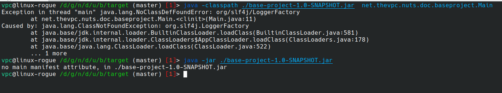

<<<


=== Alternatives for deployment

* System PM / Installers
* Portable Installers
* Custom Deployments
* Build time Processors (Fat Jars)

<<<

=== System PM / Installers

* `rpm`, `deb`, `dmg`, `msi`
** Native integration with OS/Env
** Centralized management
** Automatable (cmdline)
** Not portable
** Multiple deployment packages
** Problem with installing multiple versions of the same package

<<<

=== Portable Installers
* `InstallAnywhere`, `GetDown`, `IzPack`, BitRock `InstallBuilder`
** Good integration with OS/Env
** No centralized management
** Disk and network overload of dependencies
** Graphical! not suitable for automation
** Still Manual

<<<

=== Custom Deployers

* Custom (tomcat, netbeans) with multiple formats (tarball, zip)
** Manual
** No centralized management
** Difficult to automate
** Lack of integration with environment
** Disk and network overload of dependencies


<<<

=== Fat Packages: maven-dependency-plugin

* `maven-dependency-plugin`
** Maven plugin
** Jars included in the "lib" folder
** Still need to bundle the jar and the lib folder (zip with `maven-antrun-plugin`)

image::images/maven-dependencies-xml.png[]
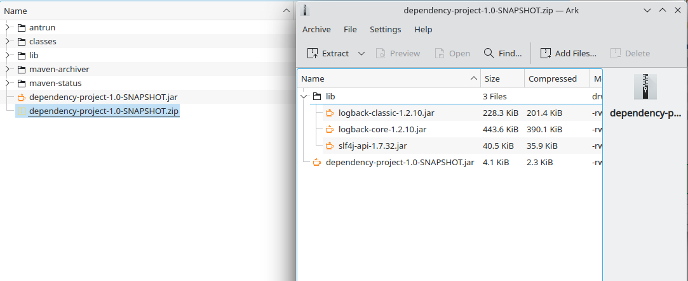


<<<


=== Fat Jars : Uber Jar
* `maven-assembly-plugin`
** Jars deflated into the same jar
** Can rewrite classes/resources
* `maven-shade-plugin`
** Jars deflated into thesame jar
** Rewrites classes/resources
** Simpler than `maven-assembly-plugin`

image::images/assembly-xml.png[]
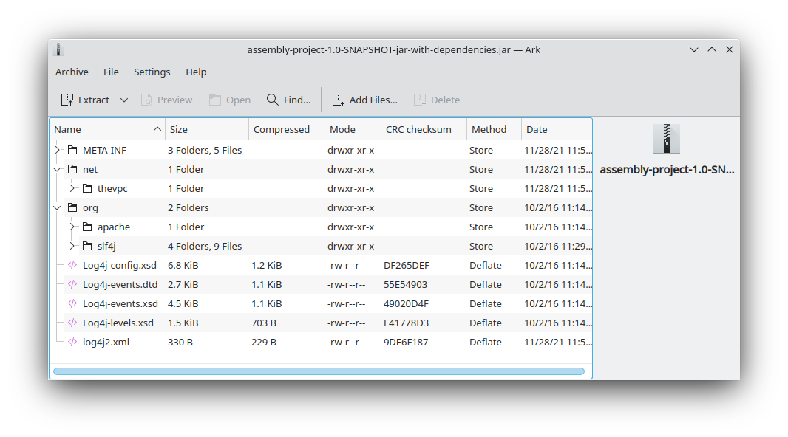


<<<

=== Fat Jars : Jar Jar
* `onejar-maven-plugin`
** Rewrites jar to include dependencies as jars!
** Adds bootstrap classes
** Changes classloader
* `spring-boot-maven-plugin`
** Rewrites jar to include dependencies as jars!
** Adds bootstrap classes
** Changes classloader

image::images/spring-boot-xml.png[]
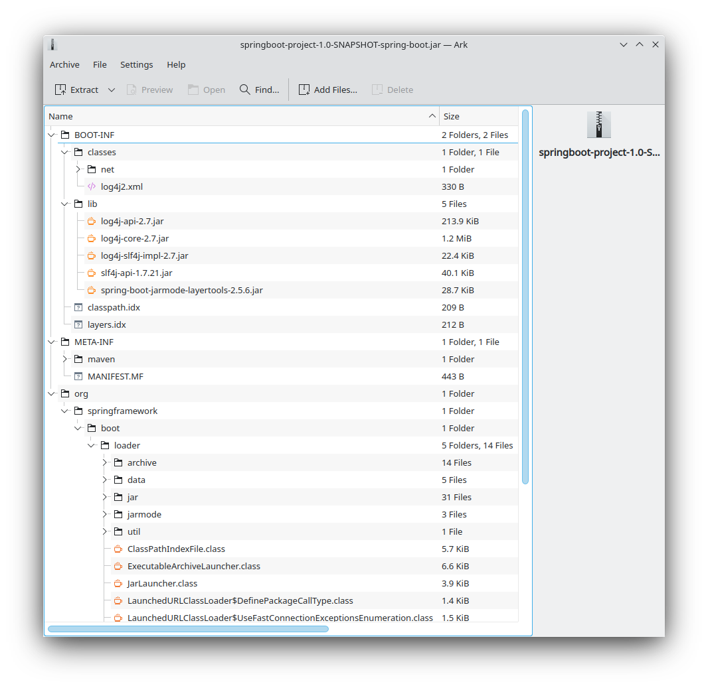

<<<

=== So...

* All alternatives are *poor* and/or *ugly*
* `pom.xml` polluted with +16-20 lines of code
* [line-through]#Why do we need a package manager for `Java`#
* Why don't we already have a package manager for `Java`!

<<<

== nuts Package Manager for Java

Main Idea:

* Open Source
* Simple but extensible Package Manager for Java
* Good Integration with Java ecosystem and popular build/deploy/devops tools
* Little to no Intrusion and Backward compatibility to support existing apps and repos
* Solid enough to support multiple platforms

<<<

=== nuts: A Package Manager for Java

Is:

* Centralized package manager for Java Apps and Libs (not only)
**  `install`,  `uninstall`,  `update` `search` and `exec` for packages
** Optimized dependency resolution solver
** Cache for dependencies across installed apps
* Automation/devops friendly commandline tool
* Developed in java
* Portable across OSes, Architectures, Desktop Environments
* Libre and Open Source

<<<

=== nuts: A Package Manager for Java

Is Not:

* a replacement for `maven`, `gradle` or any build tool
* a plugin for `maven`, `gradle` or any build tool
* a replacement for `spring` framework or any other framework
* a replacement for `IzPack` or `InstallAnywhere` (but can do pretty much of it)
* a replacement for `ansible` or `chef` (but is conceptually driven by automation)
* a mere download tool

<<<

=== nuts: Unique features

* Solid integration with environments
** Uses OS's File System Layouts (XDG for Linux, ...)
** Supports cmdline and gui apps (installs scripts, icons, menus, ...)
** Download/Caches/Installs only relevant dependencies (according to arch ...)
* Integrates seamlessly with `maven`
** No required modification of the build process
** No special `maven`/`gradle` plugin needed
** Does not alter/rewrite the package

<<<

=== nuts: Unique features
* Solves at runtime what `maven`/`gradle` solve at build time
** Supports `maven` and `gradle` dependency resolution algorithms, scopes, ...
* Supports out of the box
** `maven` 's repos (including central, spring, google, ...)
** Apache repos
** Powerful toolbox with `props`, `xml`, `json`, `yaml`, `table`, `tree`, ... output formats
** Bundles a `bash`/`GNU binutils` compatible (still incomplete) but **enhanced** java implementations
* Is statically built and has (almost) no dependencies


<<<

=== 'nuts'... really?

* `N` etwork   `U` pdatable   `T` hings `S`   ervices
* The `nuts` (fool) companion for the `maven` (sage)

<<<

=== nuts stability

* Tested:
** over 140 regression tests with 3500+ lines of test-code in the repository.
** `opensuse`, `ubuntu`, `docker`, `windows7`, `windows10`
** `sh`, `bash`, `csh`, `zsh`, `fish`

<<<

== Demonstration

=== Run the app

* We can just run the app, with no modification

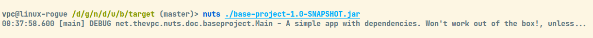

<<<

=== Demonstration : Install Application

* Or we can install the app (and its `required` dependencies)

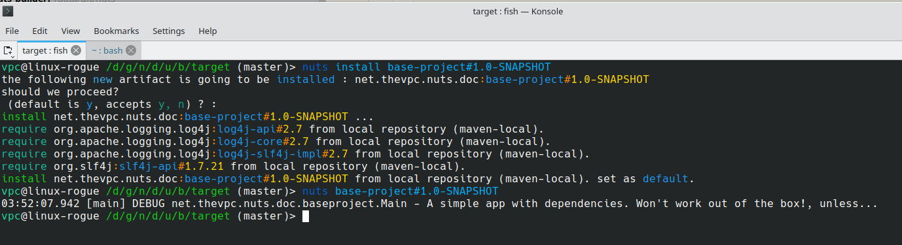

<<<

=== Install Gui App

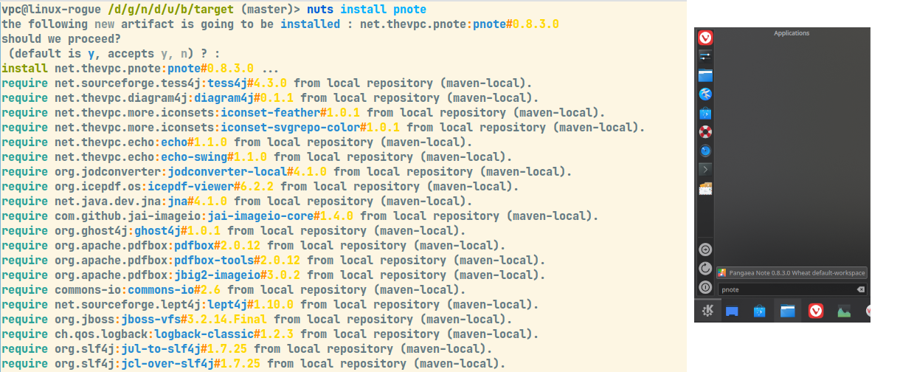


<<<

=== Search for available applications

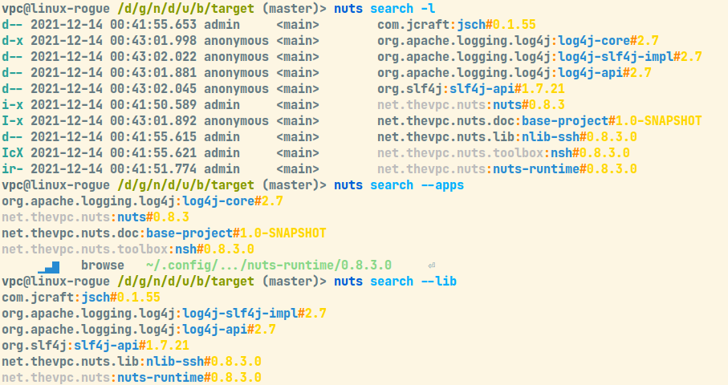

<<<

=== Integration And Formats

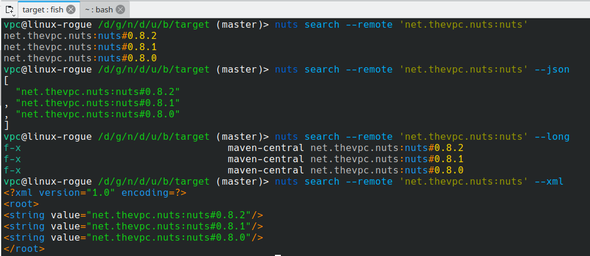

<<<

=== Companions

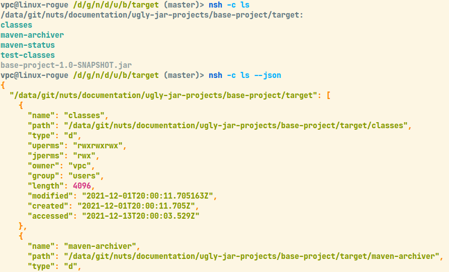

<<<

=== Bot Mot

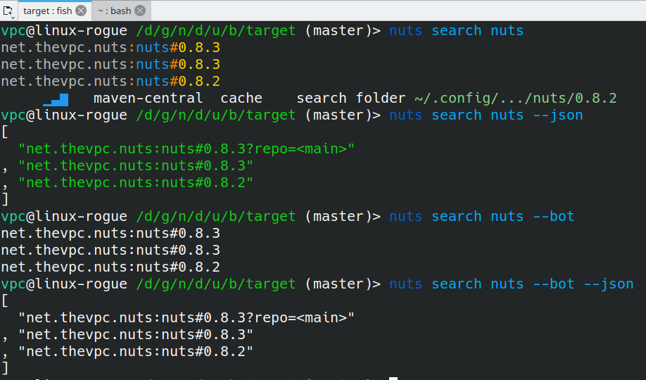


