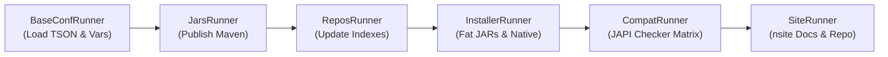

# 🌐 Nuts Documentation Website Source (`nsite`)

This directory contains the source templates, page definitions, modular inclusions, and static assets used by **`nsite`** (via **`nuts-release-tool`**) to compile the public static website hosted on GitHub Pages ([https://thevpc.github.io/nuts](https://thevpc.github.io/nuts)).

---

## ⚠️ CRITICAL NOTICE FOR CONTRIBUTORS

> [!WARNING]
> **DO NOT EDIT FILES IN `docs/` DIRECTLY!**
> The root `docs/` directory is the compiled static HTML/JS output destination. Any direct changes to files in `docs/` will be **permanently overwritten** when `nuts-release-tool` is executed.
> 
> Always edit website sources in `documentation/website/src/` or repository templates in `documentation/repo/src/main/`, then run `./nuts-release-tool` (or `nuts-release-tool.bat` on Windows) from the repository root to regenerate `docs/`.

---

## 📁 Website Source Directory Structure

```text
documentation/website/
├── archive/           # ⚠️ DEPRECATED / IRRELEVANT - Legacy historical drafts (Do NOT edit)
└── src/               # Active website sources compiled by nsite
    ├── include/       # Modular markdown inclusions, page fragments, and layout partials
    │   ├── apps/      # Application catalog cards and categories
    │   ├── blog/      # Release announcements and blog posts
    │   ├── contrib/   # Contributor guidelines partials
    │   ├── doc-naf/   # NAF framework documentation chapters
    │   ├── doc-nuts/  # Nuts user manual chapters & command references
    │   ├── download/  # Download options (RPM, DEB, standalone JARs, GUI installers)
    │   ├── faq/       # Frequently asked questions content
    │   └── template/  # Shared HTML headers, footers, navigation, and preambles
    ├── main/          # Entry-point HTML page templates processed by nsite
    │   ├── index.html       -> Compiles to docs/index.html (Main landing page)
    │   ├── doc-nuts.html    -> Compiles to docs/doc-nuts.html (Core user documentation)
    │   ├── doc-naf.html     -> Compiles to docs/doc-naf.html (NAF developer manual)
    │   ├── download.html    -> Compiles to docs/download.html (Downloads & package manager hub)
    │   ├── apps.html        -> Compiles to docs/apps.html (App showcase catalog)
    │   ├── blog.html        -> Compiles to docs/blog.html (Release log & updates)
    │   ├── faq.html         -> Compiles to docs/faq.html (FAQ)
    │   ├── contrib.html     -> Compiles to docs/contrib.html (Contributor guide)
    │   ├── compat_reports/  -> Pre-generated API & binary compatibility reports
    │   └── versions/        -> Pre-generated version manifests
    ├── resources/     # Static web assets copied verbatim to docs/
    │   ├── assets/    # CSS, SASS, vendor JS (Bootstrap, FontAwesome, Highlight.js)
    │   └── downloads/ # Pre-packaged distribution JARs and launchers
    └── script/        # NExpr site configuration scripts
        └── project.nexpr   # Dynamic version definitions (LTS & preview versions, URLs)
```

---

## 📂 Detailed Directory Reference

### 1. `src/main/` — Page Entry Points
These are the primary HTML template pages evaluated by `nsite`. Each template incorporates shared preambles (`01-preamble.html`), headers (`11-header-nuts.html`), footers (`30-footer.html`), and dynamic content blocks loaded from `src/include/`.

### 2. `src/include/` — Modular Markdown & Page Partials
Contains modular markdown and HTML sections included by `src/main/` pages:
- **`download/01-download/`**: Modular download sections (`01-download-standard.md`, `02-download-lts.md`, `03-download-installer.md`, `04-download-offline-binaries.md`, `05-download-archive.md`).
- **`doc-nuts/`**: Nuts user guide split by topics (installation, workspace concepts, CLI commands, settings).
- **`doc-naf/`**: NAF framework developer guide (execution model, UI formatting, process execution, expression evaluation).

### 3. `src/resources/` — Static Web Assets
Static assets copied verbatim into `docs/` during generation. Includes stylesheets, fonts, vendor scripts, and downloadable binaries.

### 4. `src/script/project.nexpr` — Generation Context & Variables
Defines key site variables (version numbers, download links, Maven coordinates) evaluated by NExpr at the start of website generation.

---

## ⛔ `archive/` Directory (Deprecated)

> [!CAUTION]
> **Status: Deprecated / Irrelevant**
> The `documentation/website/archive/` folder contains historical website drafts (`v2024`, `v2025`, `v2026`, `other-src`) from older site iterations prior to the `nsite` migration.
> 
> **Do not edit files inside `archive/`**. They are kept solely for historical context and are not included in active website builds.

---

## 🛠️ Release & Site Generator Architecture (`nuts-release-tool`)

The website compilation, root repository documentation, fat JAR packaging, native binaries, and API compatibility reports are driven by `nuts-release-tool` (`net.thevpc.nuts.build`).

### ⚙️ Build Pipeline



1. **`BaseConfRunner`**: Resolves `nuts-release-tool.tson` (and `nuts-release-tool.local.tson`), context mappings, and `vars`.
2. **`JarsRunner`**: Resolves LTS/preview version numbers and publishes Maven artifacts if `publish: true`.
3. **`ReposRunner`**: Updates catalog indexes for `nuts-preview` and `nuts-public`.
4. **`InstallerRunner`**: Packages fat JARs, GraalVM native binaries, and platform bundles.
5. **`CompatRunner`**: Executes `japi-compliance-checker` and generates API compatibility matrix reports in `src/main/compat_reports/`.
6. **`SiteRunner`**: Runs **`nsite`** to compile website templates to `$NUTS_REPO_ROOT/docs/` and sync interpolated templates in `documentation/repo/src/main/` to the repository root.

---

## 🚩 Configuration Flags Reference (`nuts-release-tool.tson`)

The release configuration file (`nuts-release-tool.tson` or `nuts-release-tool.local.tson`) controls the build process through the following flags:

| Flag | Type | Description |
| :--- | :--- | :--- |
| **`build-jars`** | `boolean` | **Build Portable Fat JARs (`PackageType.PORTABLE`)**.<br>When `true`, packages self-contained JARs for `nuts-installer` (`net.thevpc.nuts.installer.NutsInstaller`) and `nuts-app-full` (`net.thevpc.nuts.NutsApp`), copying them into `installers/dist/<version>/` along with SHA-256 checksums. |
| **`build-native`** | `boolean` | **Build Native Platform Executables & Bundles**.<br>When `true`, generates native binaries (AOT compiled via GraalVM `native-image`), `jpackage` installers, and JRE 8 bundles for Linux, Windows, and macOS. |
| **`build-site`** | `boolean` | **Build Documentation Website & Sync Repository**.<br>When `true`, runs `nsite` to evaluate `project.nexpr`, compile pages (`website/src/main/*.html`), embed partials (`website/src/include/`), copy static assets verbatim (`website/src/resources/`), emit static files to `$NUTS_REPO_ROOT/docs/`, and sync interpolated files to repository root (`repo/src/main/`). |
| **`build-repos`** | `boolean` | **Update Repository Statistics & Catalogs**.<br>When `true`, executes `nuts settings update stats` on both `../nuts-repos/nuts-preview` and `../nuts-repos/nuts-public`. |
| **`build-repo-nuts-preview`** | `boolean` | Rebuilds catalog indexes specifically for `../nuts-repos/nuts-preview`. |
| **`build-repo-nuts-public`** | `boolean` | Rebuilds catalog indexes specifically for `../nuts-repos/nuts-public`. |
| **`build-compat`** | `boolean` | **Generate API Backward Compatibility Matrix**.<br>When `true`, invokes `japi-compliance-checker` on pairwise combinations of versions in `all-versions`, generates HTML change reports under `website/src/main/compat_reports/`, and builds the matrix table. |
| **`publish`** | `boolean` | **Push / Deploy Artifacts to Production Server**.<br>When `true`, uploads compiled JARs, native packages, checksums, and Maven artifacts to the production server (`thevpc.net`). |
| **`all-versions`** | `list` / `string` | List of version identifiers to include in API compatibility checks (e.g. `["0.8.0", ..., "0.8.9", "1.0.0"]`). |
| **`stable-api-version`** | `string` | Version identifier for the LTS API (e.g. `"0.8.9"`). |
| **`stable-app-version`** | `string` | Version identifier for the LTS App (e.g. `"0.8.9"`). |
| **`stable-runtime-version`**| `string` | Version identifier for the LTS Runtime (e.g. `"0.8.9.0"`). |
| **`trace`** | `boolean` | Enables trace-level logging (`NSession.of().trace(true)`). |
| **`verbose`** | `boolean` | Enables verbose logging output (`Level.FINEST`). |
| **`debug`** | `boolean` | Appends JVM remote socket debugging flags (`-agentlib:jdwp=...`). |
| **`vars`** | `object` | Environment paths and deployment settings: JDK homes (`JAVA8_HOME`, `JAVA17_HOME`), GraalVM directory (`NUTS_GRAALVM_DIR`), JRE 8 archive paths (`INSTALLER_JRE8_*`), and remote deployment targets. |

---

## 🚀 How to Build & Refresh the Website

To re-compile `documentation/website/src/` into the static `docs/` website and sync repository markdown files:

1. Compile the repository first:
   ```bash
   mvn clean install
   ```

2. Run `nuts-release-tool` from the **repository root**:
   ```bash
   # On Linux / macOS:
   ./nuts-release-tool

   # On Windows:
   nuts-release-tool.bat
   ```

3. The updated static website will be written to `docs/`, ready for push to GitHub Pages.
