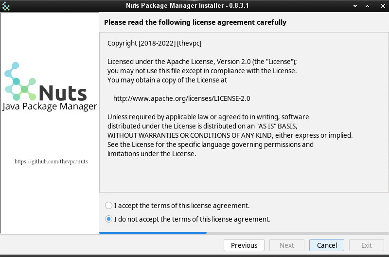
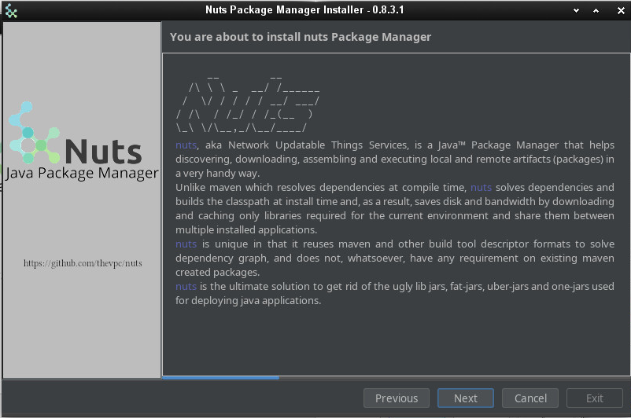

import Tabs from '@theme/Tabs';
import TabItem from '@theme/TabItem';

## GUI Installation
You can install `nuts` using a gui installer. Multiple targets are available.
You may select a portable installer (a jar that you can double click as far as you have a valid java+ runtime installed and configured in your environment).
You may also want to select a native image for the installer; you only need to download and run.


Once you launch the installer, you will be prompted first to select your favourite look : light mode or dark mode. This will customize the look of all the remaining steps.


Then, a description message is shown.


In the next step, you are asked to accept the OSS licence.


`nuts` comes with a dual version, stable and preview. Stable version is recommended in most cases. But if you want to take advantage of new features not yet released you may want to install the preview version.


The installer will even prompt you for selecting extra java applications you may want to install along with `nuts`. The only recommended apps are already selected and marked as `Companions`. This includes mostly `nsh`, a bash compatible implementation in Java.


Then, you may want to tune some nuts options. Please note that by default, any existing workspace will be erased. So if you want to preserve you older installation, deselect "Reset Workspace (-Z)".
"Verbose" and "Log file" are also good options to consider if some thing odd occurs during the installation process. This will leverage more debug messages to be printed and stored to log files you attach when contacting the dev team.


Now the effective installation starts. You will see the progress in a colourful terminal.


And voilà! you now have reached the installation end. Just click on Exit.


If you check your system menu, you will notice some new icons, including a `nuts aware` terminal. On Linux and MacOs, you do not need such menu to run you favorite nuts command though. The Installer has already configured your shell rc files to include nuts in the execution `PATH` env variable.

Here is and example af your menu when using Enlightenment Desktop Environment on Linux


## Dark Mode

You may have chosen the Dark mode of course, and you would have crossed the following steps:





## Your first commands
After installation, open any nuts `aware terminal` (on linux, any bash,zsh,fish,... terminal is ok).

```bash
$> nuts

$> nuts update

$> nuts search

$> nuts search 'net.thevpc.nuts.toolbox:*' --anywhere
 
        net.thevpc.nuts.toolbox:nsh#net.thevpc.nuts.runtime.standalone.io.printstream.NPrintStreamFiltered@5745ca0e
        net.thevpc.nuts.toolbox:ndoc#net.thevpc.nuts.runtime.standalone.io.printstream.NPrintStreamFiltered@5745ca0e
        net.thevpc.nuts.toolbox:ndexer#net.thevpc.nuts.runtime.standalone.io.printstream.NPrintStreamFiltered@5745ca0e
        net.thevpc.nuts.toolbox:njob#net.thevpc.nuts.runtime.standalone.io.printstream.NPrintStreamFiltered@5745ca0e
        net.thevpc.nuts.toolbox:nmvn#net.thevpc.nuts.runtime.standalone.io.printstream.NPrintStreamFiltered@5745ca0e
        net.thevpc.nuts.toolbox:nwork#net.thevpc.nuts.runtime.standalone.io.printstream.NPrintStreamFiltered@5745ca0e
        net.thevpc.nuts.toolbox:nsh#net.thevpc.nuts.runtime.standalone.io.printstream.NPrintStreamFiltered@5745ca0e
        net.thevpc.nuts.toolbox:ntomcat#net.thevpc.nuts.runtime.standalone.io.printstream.NPrintStreamFiltered@5745ca0e
        net.thevpc.nuts.toolbox:ntalk-agent#net.thevpc.nuts.runtime.standalone.io.printstream.NPrintStreamFiltered@5745ca0e
        net.thevpc.nuts.toolbox:ndiff#net.thevpc.nuts.runtime.standalone.io.printstream.NPrintStreamFiltered@5745ca0e
        net.thevpc.nuts.toolbox:nserver#net.thevpc.nuts.runtime.standalone.io.printstream.NPrintStreamFiltered@5745ca0e
        net.thevpc.nuts.toolbox:ndb#net.thevpc.nuts.runtime.standalone.io.printstream.NPrintStreamFiltered@5745ca0e
        net.thevpc.nuts.toolbox:nversion#net.thevpc.nuts.runtime.standalone.io.printstream.NPrintStreamFiltered@5745ca0e
        net.thevpc.nuts.toolbox:ntemplate#net.thevpc.nuts.runtime.standalone.io.printstream.NPrintStreamFiltered@5745ca0e
        net.thevpc.nuts.toolbox:ncode#net.thevpc.nuts.runtime.standalone.io.printstream.NPrintStreamFiltered@5745ca0e
        net.thevpc.nuts.toolbox:ndocusaurus#net.thevpc.nuts.runtime.standalone.io.printstream.NPrintStreamFiltered@5745ca0e
        net.thevpc.nuts.toolbox:noapi#net.thevpc.nuts.runtime.standalone.io.printstream.NPrintStreamFiltered@5745ca0e

$> nuts install org.jedit:jedit

$> nuts jedit

$> nuts install njob

$> nuts update njob
 
$> nuts install netbeans-launcher

$> nuts netbeans-launcher
 


```


